# Mermaid Diagram Snippets

Reusable Mermaid patterns for documentation. Copy and customize for specific projects.

## C4 Architecture Diagram

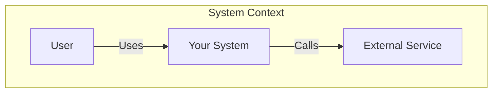

## Layered Architecture

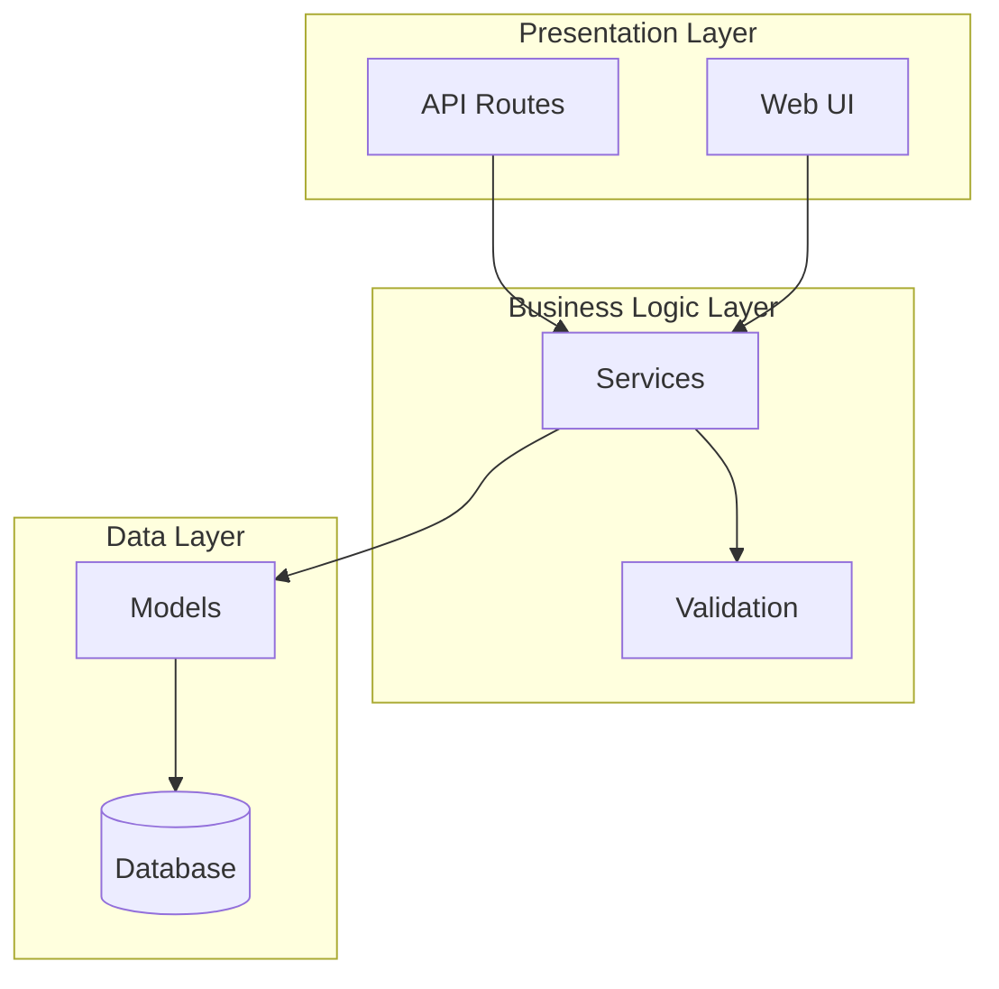

## Request/Response Sequence

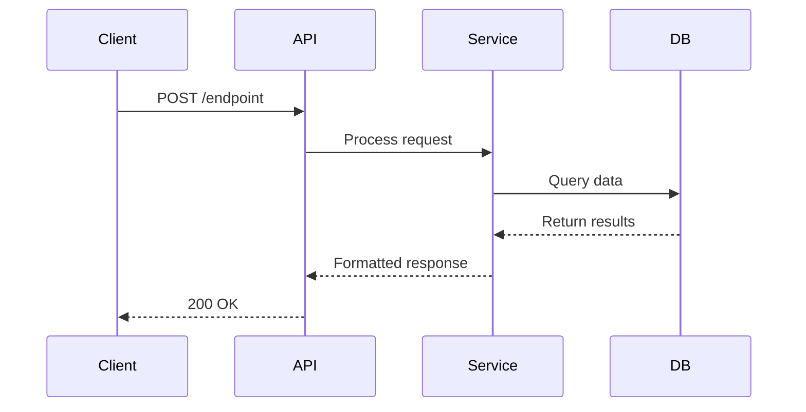

## Component Dependency Graph

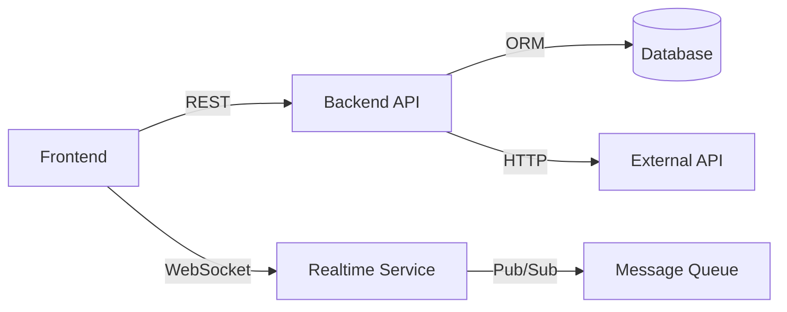

## State Machine

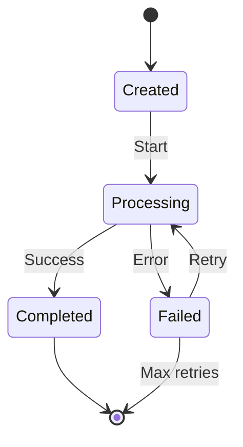

## Monorepo Structure

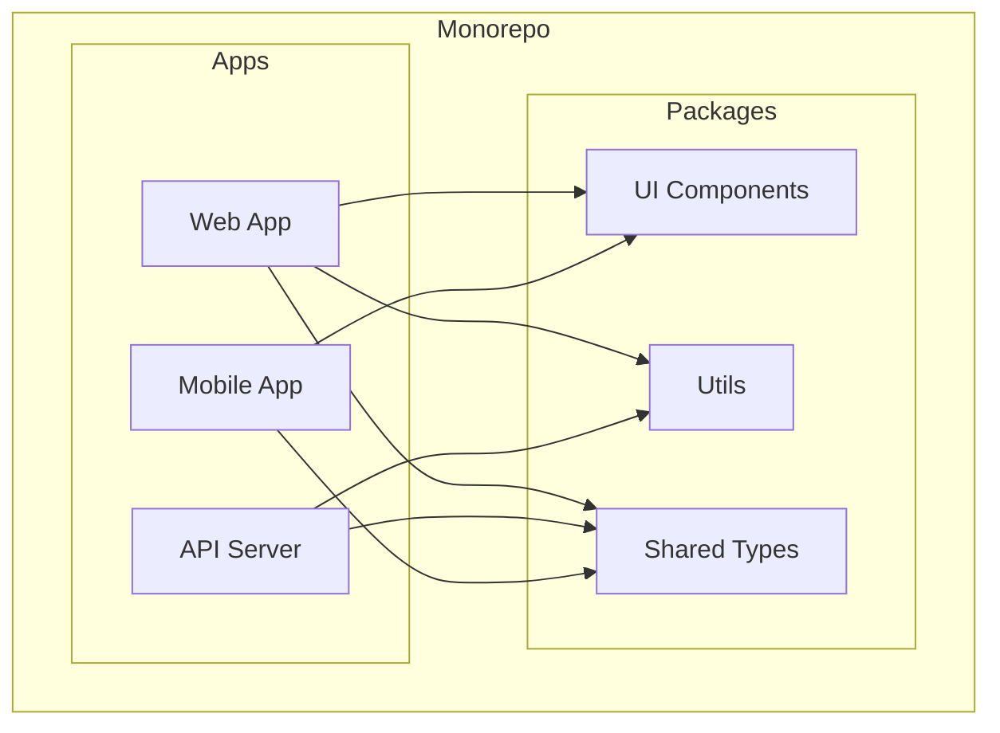

## Data Flow Pipeline

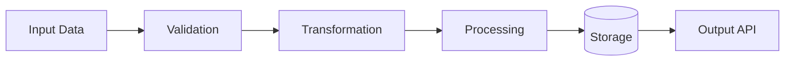

## Microservices Architecture

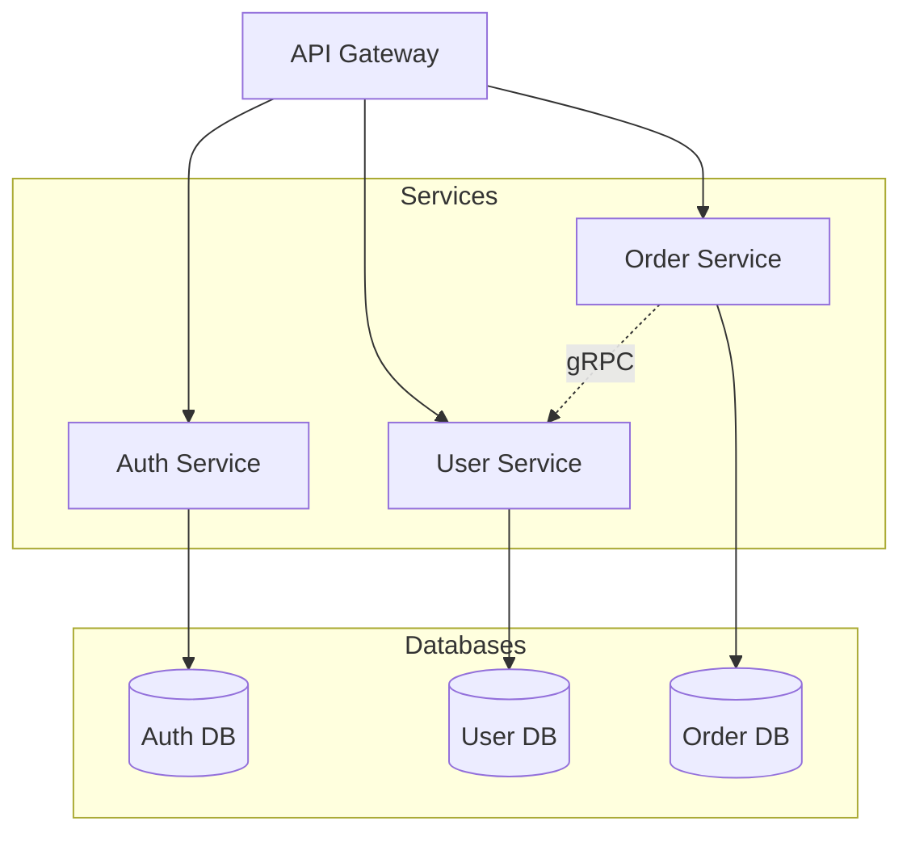

## Component Hierarchy (React/Frontend)

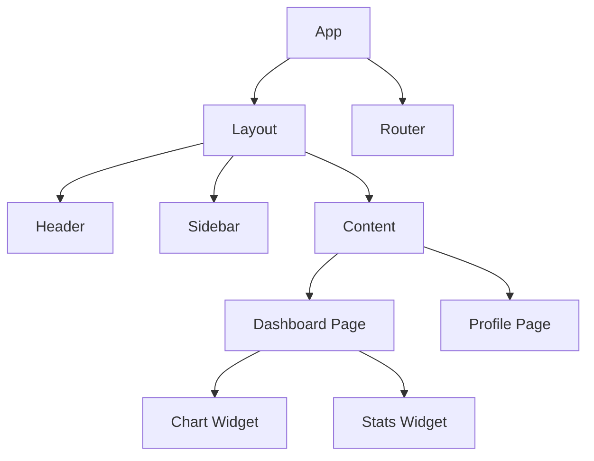

## Deployment Pipeline

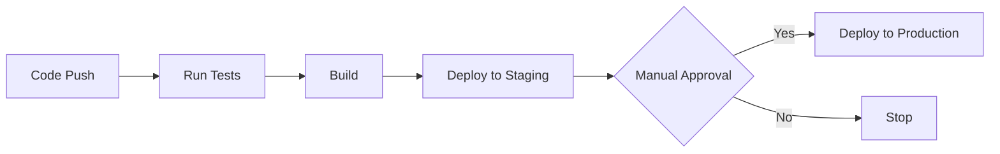

## Database Schema (ER Diagram)

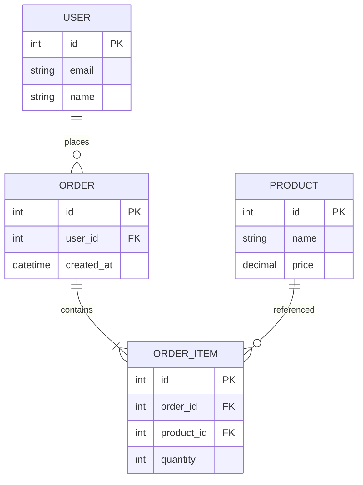

## Authentication Flow

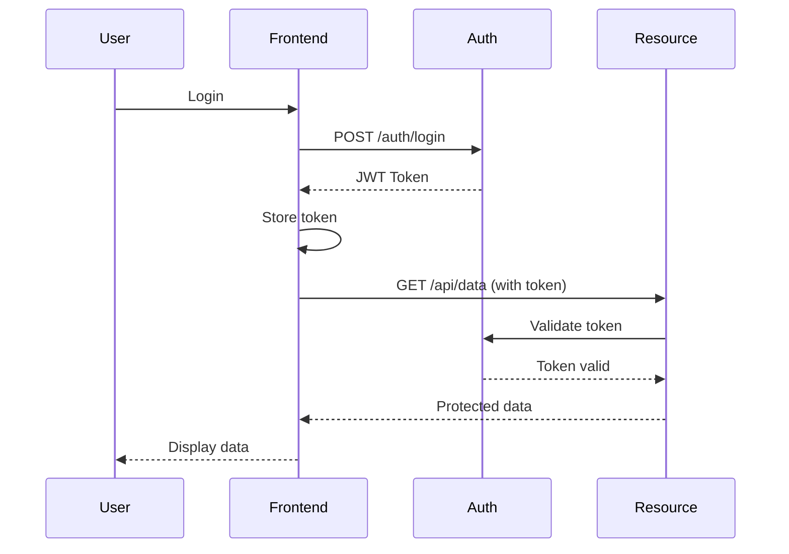

## Branching Strategy

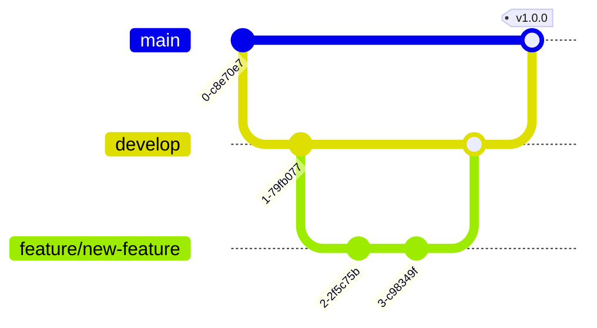

## Usage Tips

1. **Choose the right diagram type:**
   - Architecture overview → C4 or component graph
   - API flow → Sequence diagram
   - State management → State diagram
   - Data models → ER diagram

2. **Keep it simple:**
   - Limit to 10-15 nodes per diagram
   - Use subgraphs for grouping
   - Avoid crossing arrows when possible

3. **Add context:**
   - Label all arrows with actions
   - Use descriptive node names
   - Add notes for complex interactions

4. **Customize for your stack:**
   - Replace generic names with actual service names
   - Update node types to match your tech
   - Add technology icons if supported
