# Mermaid Graphs

Create diagrams from text using Mermaid syntax and present them visually.

## Quick Presentation Methods

### 1. Browser Preview (Fastest)
```bash
python3 scripts/preview.py diagram.mmd           # Opens mermaid.live
python3 scripts/preview.py diagram.mmd -m local  # Local HTML file
python3 scripts/preview.py diagram.mmd -m kroki  # Via kroki.io
```

### 2. Render to File
```bash
python3 scripts/render.py diagram.mmd -o output.png
python3 scripts/render.py diagram.mmd -o output.svg -t dark
python3 scripts/render.py diagram.mmd -o output.pdf
```
Requires: `npm install -g @mermaid-js/mermaid-cli`

### 3. Inline URL (No File Needed)
Generate and open URL directly:
```python
import base64, zlib, json, webbrowser
code = "graph TD\n  A-->B"
state = {"code": code, "mermaid": {"theme": "default"}, "autoSync": True}
encoded = base64.urlsafe_b64encode(zlib.compress(json.dumps(state).encode(), 9)).decode()
webbrowser.open(f"https://mermaid.live/edit#pako:{encoded}")
```

## Diagram Types & Syntax

### Flowchart
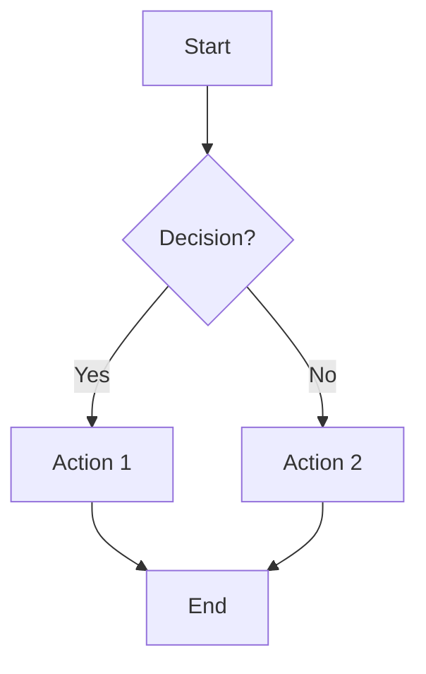
Directions: `TD` (top-down), `LR` (left-right), `BT`, `RL`
Shapes: `[rect]`, `(rounded)`, `{diamond}`, `([stadium])`, `[[subroutine]]`, `[(cylinder)]`, `((circle))`

### Sequence Diagram
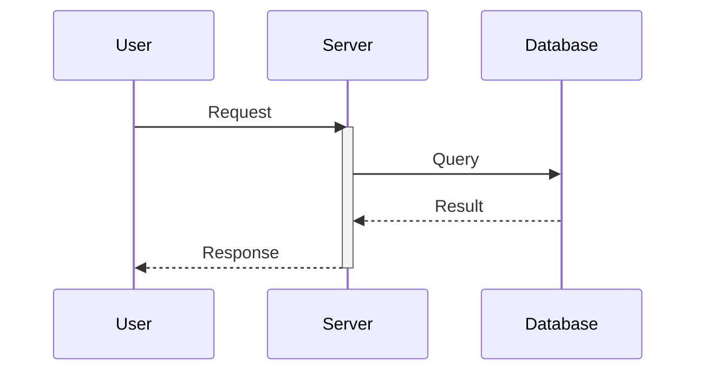
Arrows: `->>` (solid), `-->>` (dashed), `-x` (cross), `-)` (async)

### Class Diagram
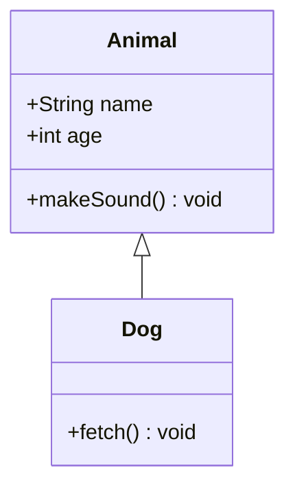
Relations: `<|--` (inheritance), `*--` (composition), `o--` (aggregation), `-->` (association), `..>` (dependency)

### State Diagram
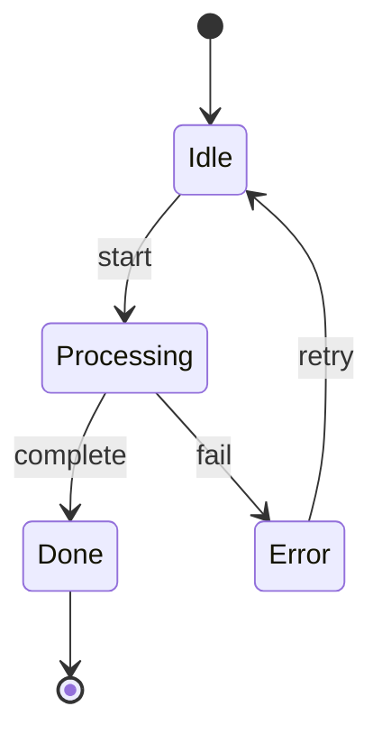

### Entity Relationship
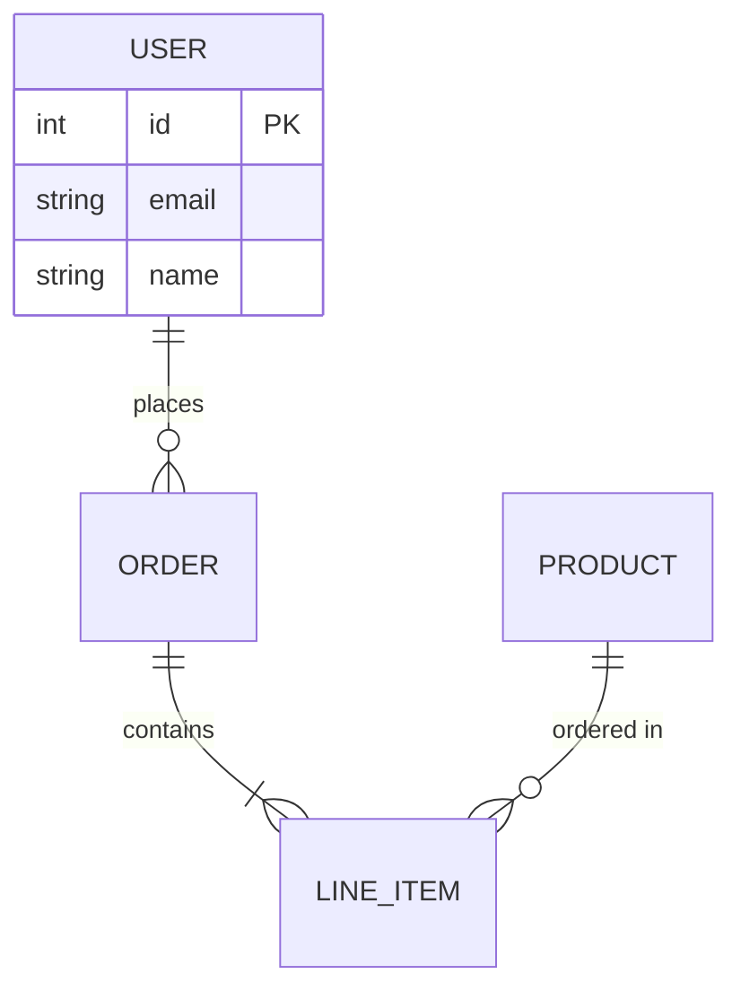
Cardinality: `||` (one), `o{` (zero+), `|{` (one+), `o|` (zero/one)

### Gantt Chart
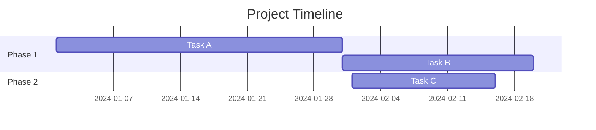

### Pie Chart
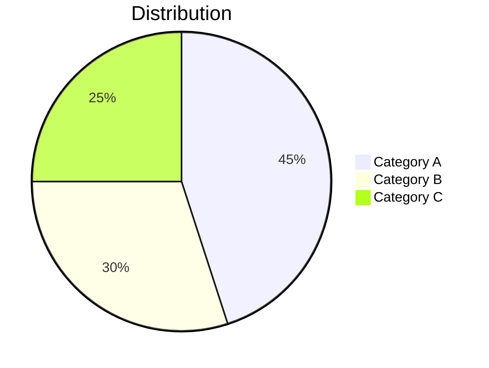

### Mindmap
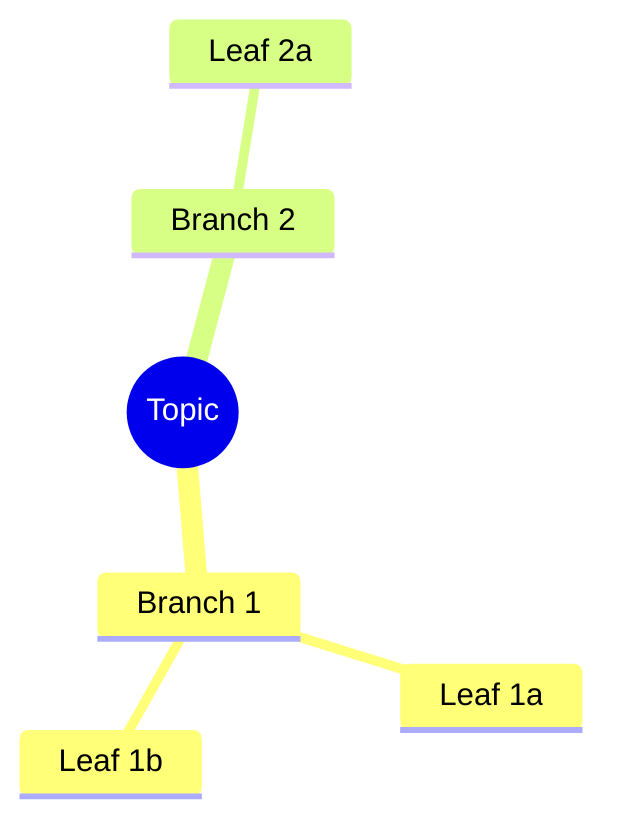

### Timeline
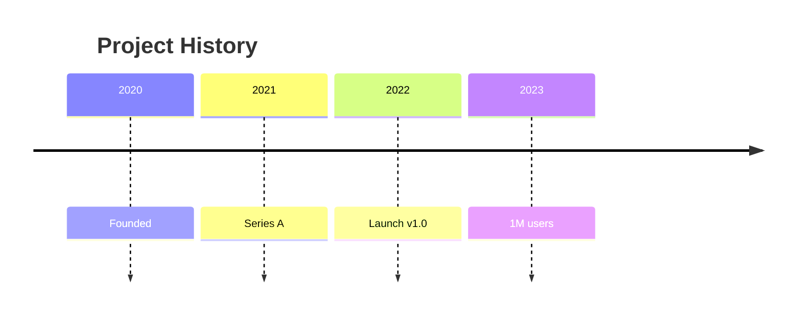

### Quadrant Chart
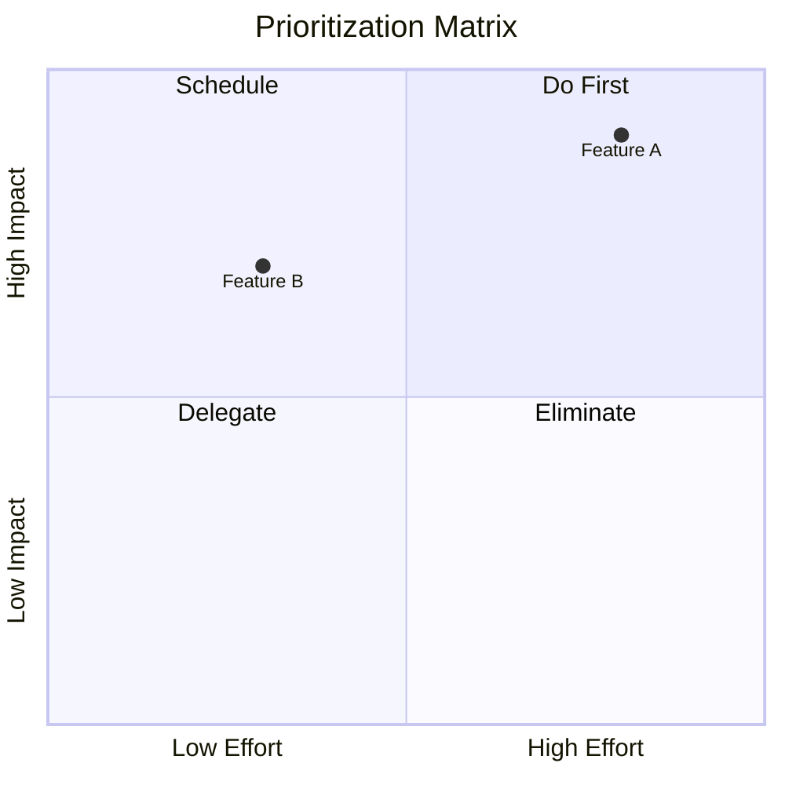

### Git Graph
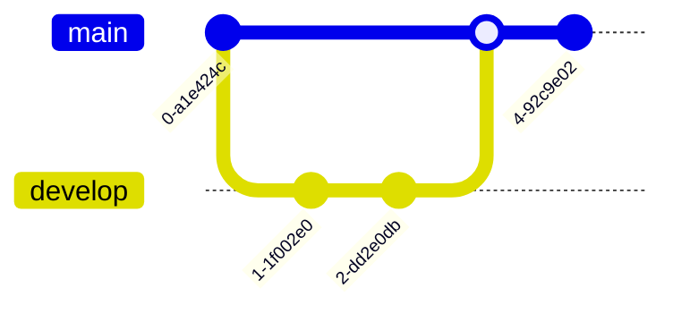

## Styling

### Inline Styles
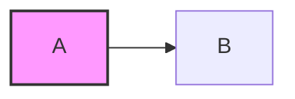

### Theme Options
- `default` - Standard colors
- `forest` - Green tones
- `dark` - Dark background
- `neutral` - Grayscale

## Workflow

1. Write diagram in `.mmd` file or inline
2. Preview quickly: `python3 scripts/preview.py file.mmd`
3. If needed, render to file: `python3 scripts/render.py file.mmd -o output.png`
